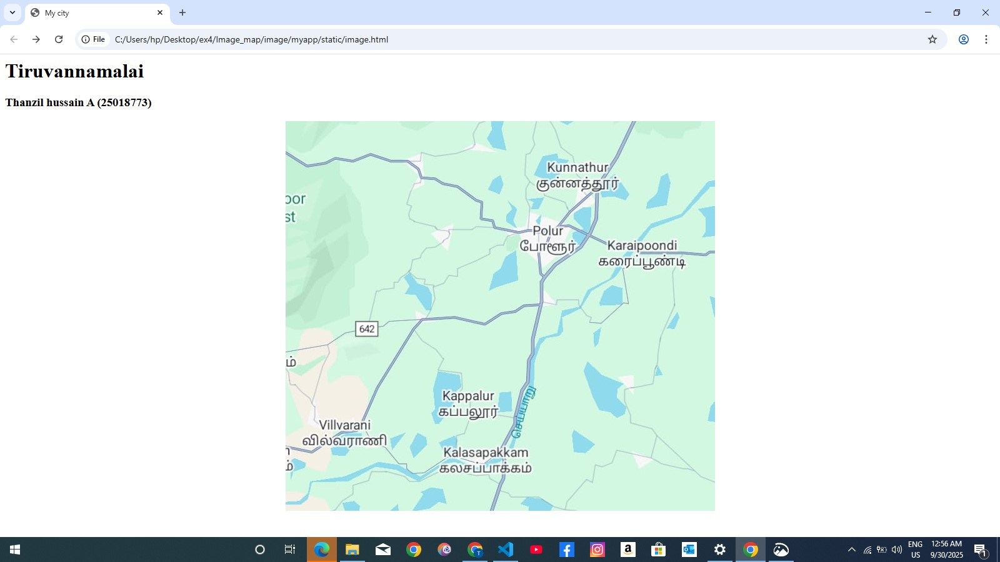
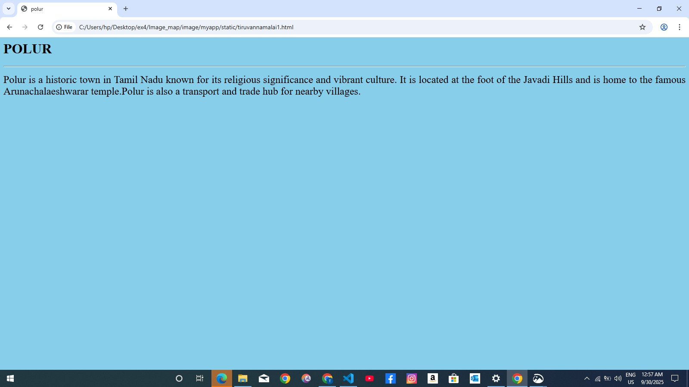
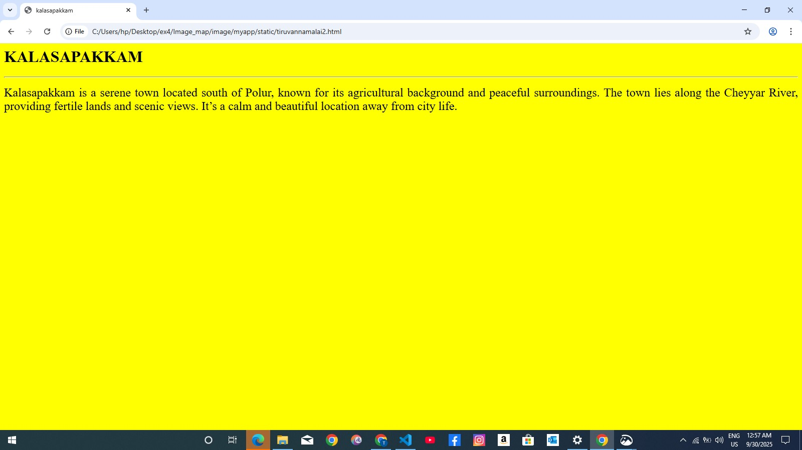
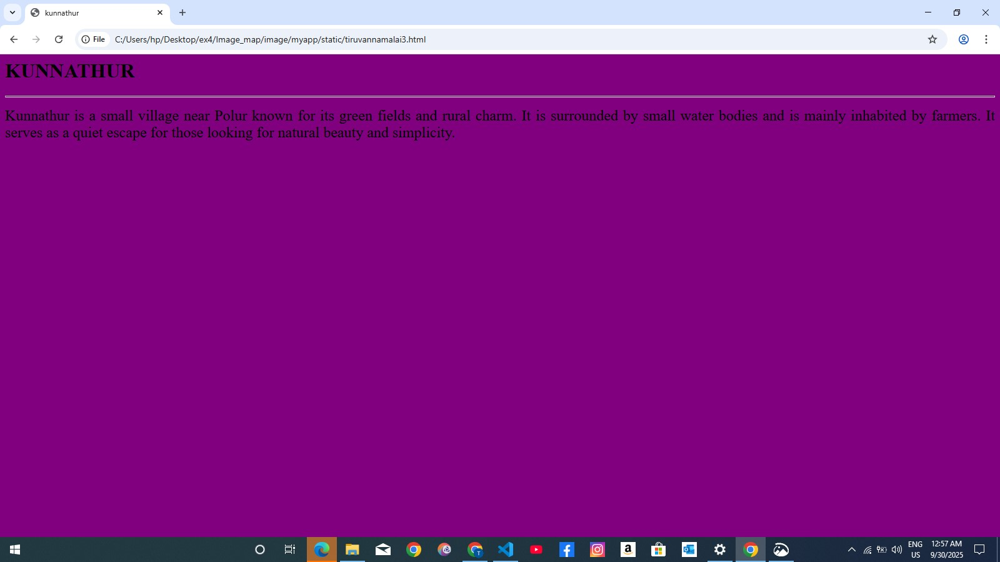
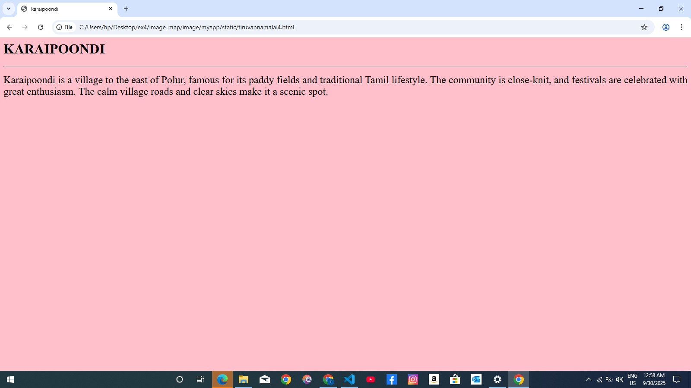
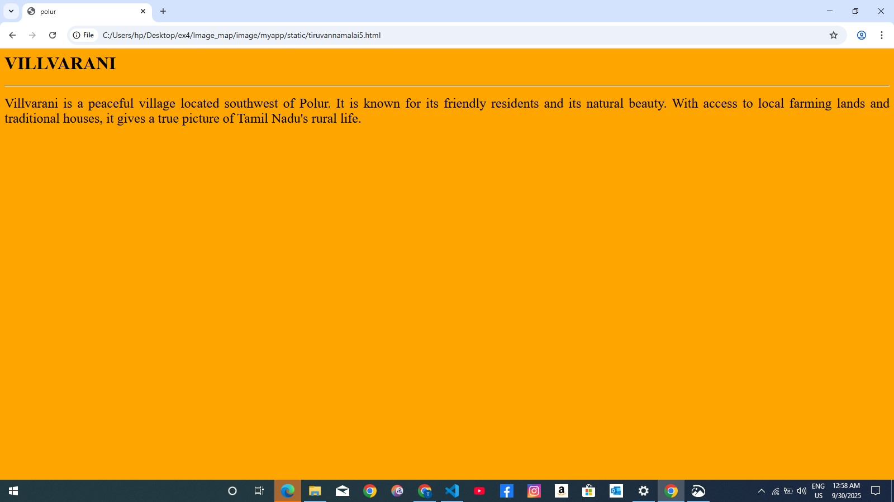

# Ex04 Places Around Me
# Date:01/10/2025
# AIM
To develop a website to display details about the places around my house.

# DESIGN STEPS
## STEP 1
Create a Django admin interface.

## STEP 2
Download your city map from Google.

## STEP 3
Using <map> tag name the map.

## STEP 4
Create clickable regions in the image using <area> tag.

## STEP 5
Write HTML programs for all the regions identified.

## STEP 6
Execute the programs and publish them.

# CODE
'''
map.html

<html>
    <head>
        <title>My city</title>
    </head>
    <body>
        <h1 align ="centre">
            <front colour="red"><b>Tiruvannamalai</b></front>
        </h1>
        <h3 align="centre">
            <front colour="blue"><b>Thanzil hussain A (25018773)</b></front>
        </h3>

    

<map name="Mycity">
    <area target="" alt="polur" title="polur" href="tiruvannamalai1.html" coords="365,158,470,219" shape="rect">
    <area target="" alt="kalasapakkam" title="kalasapakkam" href="tiruvannamalai2.html" coords="243,520,401,568" shape="rect">
    <area target="" alt="kunnathur" title="kunnathur" href="tiruvannamalai3.html" coords="409,61,532,107" shape="rect">
    <area target="" alt="karaipoondi" title="karaipoondi" href="tiruvannamalai4.html" coords="508,186,642,233" shape="rect">
    <area target="" alt="villvarani" title="villvarani" href="tiruvannamalai5.html" coords="26,473,159,522" shape="rect">
</map>

    </body>
</html>

tiruvannamalai1.html

<html>
    <head>
        <title>polur</title>
    </head>
    <body bgcolor="skyblue">
        <h1 align ="centre">
            <front colour="red"><b>POLUR</b></front>
        </h1>
        

        

            
                Polur is a historic town in Tamil Nadu known for its religious significance and vibrant culture. It is located at the foot of the Javadi Hills and is home to the famous Arunachalaeshwarar temple.Polur is also a transport and trade hub for nearby villages.
            
        

    </body>
</html>

tiruvannamalai2.html

<html>
    <head>
        <title>kalasapakkam</title>
    </head>
    <body bgcolor="yellow">
        <h1 align ="centre">
            <front colour="red"><b>KALASAPAKKAM</b></front>
        </h1>
        

        

            
        Kalasapakkam is a serene town located south of Polur, known for its agricultural background and peaceful surroundings. The town lies along the Cheyyar River, providing fertile lands and scenic views. It’s a calm and beautiful location away from city life.
        

    </body>
</html>

tiruvannamalai3.html

<html>
    <head>
        <title>kunnathur</title>
    </head>
    <body bgcolor="purple">
        <h1 align ="centre">
            <front colour="red"><b>KUNNATHUR</b></front>
        </h1>
        

        

            
        Kunnathur is a small village near Polur known for its green fields and rural charm. It is surrounded by small water bodies and is mainly inhabited by farmers. It serves as a quiet escape for those looking for natural beauty and simplicity.
            
        

    </body>
</html>

tiruvannamalai4.html

<html>
    <head>
        <title>karaipoondi</title>
    </head>
    <body bgcolor="pink">
        <h1 align ="centre">
            <front colour="red"><b>KARAIPOONDI</b></front>
        </h1>
        

        

            
        Karaipoondi is a village to the east of Polur, famous for its paddy fields and traditional Tamil lifestyle. The community is close-knit, and festivals are celebrated with great enthusiasm. The calm village roads and clear skies make it a scenic spot.
            
        

    </body>
</html>

tiruvannamalai5.html

<html>
    <head>
        <title>polur</title>
    </head>
    <body bgcolor="orange">
        <h1 align ="centre">
            <front colour="red"><b>VILLVARANI</b></front>
        </h1>
        

        

                    
                Villvarani is a peaceful village located southwest of Polur. It is known for its friendly residents and its natural beauty. With access to local farming lands and traditional houses, it gives a true picture of Tamil Nadu's rural life.
            
        

    </body>
</html>
'''
# OUTPUT

# RESULT
The program for implementing image maps using HTML is executed successfully.
